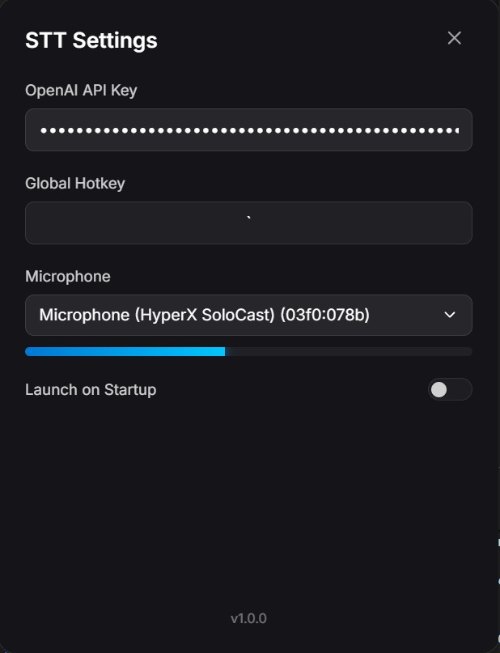

# STT Windows



A premium, background speech-to-text utility for Windows. Record your voice with a global hotkey and have it transcribed and injected directly into your active text cursor using OpenAI Whisper.

## Features

- **Global Hotkey** (`Ctrl+Shift+S`) to start/stop recording.
- **OpenAI Whisper** for high-accuracy transcription.
- **Direct Injection**: Text is pasted at your cursor automatically.
- **Modern UI**: Glassmorphism settings window with mic level feedback.
- **Auto-start**: Option to launch when Windows boots (This only works with the .exe executable).

## Quick Start

### 1. The Easy Way (Download Installer)
Download the latest **`STT Windows Setup.exe`** from the [GitHub Releases](https://github.com/JJSilvera1/stt-windows/releases) page. Run the installer to enjoy a desktop shortcut and auto-start features.

### 2. The Developer Way (Run from Code)
If you have Node.js installed and want to run the app directly:
1. Install dependencies:
   ```bash
   npm install
   ```
2. **Run with a Single Click**: 
   - Double-click `run-app.bat` to launch with a terminal window.
   - Double-click `launch-silent.vbs` to launch **silently in the background** (recommended).
3. Alternatively, use the terminal:
   ```bash
   npm start
   ```

## Setup

1. **OpenAI API Key**: Right-click the microphone icon in your system tray and select **Settings** to enter your key.
2. **Microphone**: Select your preferred device in settings. Use the visual level bar to test your volume.
3. **Launch on Startup**: Enable this in settings to have the app ready every time you boot your PC.

## Building the Installer

To generate your own standalone Windows installer:
```bash
npm run dist
```
Build artifacts will appear in the `/dist` folder.


